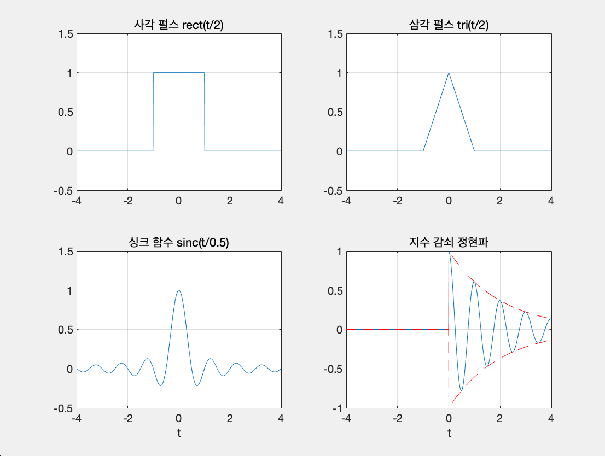

### 문제
다음 신호들의 파형을 -4<=t<=4 범위에서 그려라.
* 사각 펄스 rect(t/2)
* 삼각 펄스 tri(t/2)
* 싱크 함수 sinc(t/0.5)
* 지수 감쇠 정현파 e^(-0.5t)*cos(10*pi*t)*u(t)

### 코드
```matlab
close all;                                    % 모든 생성된 창을 닫음 
clear all;                                    % 열려있는 작업영역(workspace)을 모두 비움 
clc;                                          % 명령(command) 창을 비움

ti=-4;tf=4;dt=0.01;t=ti:dt:tf;                % 시간축 설정
xa=(-1<=t & t<=1);                            % 사각 펄스 
xb=(t+1).*(t>=-1)-2*t.*(t>=0)+(t-1).*(t>=1);  % 삼각 펄스 
J=find(t,1)-1;                                % t=0인 데이터 배열 인덱스 찾음 
for I=1:length(t)
   if I == J
       xc(I)=1;                               % 싱크 함수(t=0)  
   else
       xc(I)=sin(2*pi*t(I))/(2*pi*t(I));      % 싱크 함수 
   end
end
xd=exp(-0.5*t).*cos(2*pi*t).*(t>=0);          % 지수 감쇠 정현파 
xde=exp(-0.5*t).*(t>=0);                      % 지수 감쇠 정현파의 포락선 

subplot(2,2,1);                               % 2행 2열 분할 그림 창의 1번 창 
plot(t,xa);                                   % 계단 신호 그림
axis([ti tf -0.5 1.5]); grid on;              % x축과 y축 영역 설정, 그리드 표시
title('사각 펄스 rect(t/2)');                  % 그림 제목
subplot(2,2,2);                               % 2행 2열 분할 그림 창의 2번 창  
plot(t,xb);                                   % 사각 펄스 그림
axis([ti tf -0.5 1.5]); grid on;              % x축과 y축 영역 설정, 그리드 표시
title('삼각 펄스 tri(t/2)');                   % 그림 제목
subplot(2,2,3);                               % 2행 2열 분할 그림 창의 3번 창  
plot(t,xc);                                   % 싱크 함수 그림
axis([ti tf -0.5 1.5]); grid on;              % x축과 y축 영역 설정, 그리드 표시
title('싱크 함수 sinc(t/0.5)');                % 그림 제목
xlabel('t');                                  % x축 라벨
subplot(2,2,4);                               % 2행 2열 분할 그림 창의 4번 창  
plot(t,xd,t,xde,'--r',t,-xde,'--r');          % 지수 감쇠 정현파와 포락선 그림
axis([ti tf -1 1]); grid on;                  % x축과 y축 영역 설정, 그리드 표시
title('지수 감쇠 정현파');                     % 그림 제목
xlabel('t');                                  % x축 라벨 
```

### 출력
