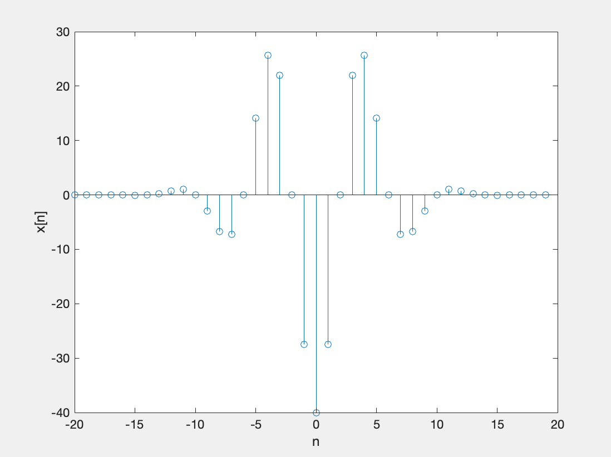
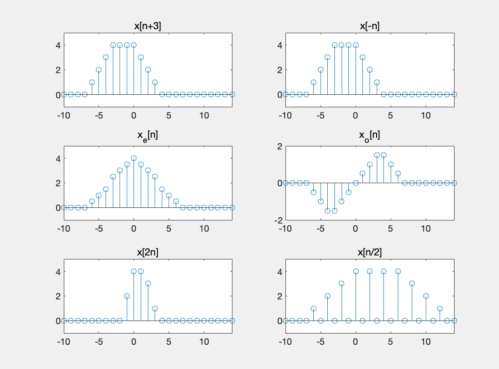

## 문제1

```matlab
close all;                                    % 모든 생성된 창을 닫음 
clear all;                                    % 열려있는 작업영역(workspace)을 모두 비움 
clc;                                          % 명령(command) 창을 비움

n=-20:19;                                     % 범위 설정
x=x1D(n).*x2D(n);                             % 식 실행
stem(n,x);                                    % 그림
xlabel('n');                                  % xlabel
ylabel('x[n]');                               % ylabel

function y=x1D(n)
    y=5*cos(2*pi*n/8);
    I=round(n)~=n;
    y(I)=NaN;
end

function y=x2D(n)
    y=-8*exp(-(n/6).^2);
    I=round(n)~=n;
    y(I)=NaN;
end
```



## 문제3

```matlab
close all;                                               % 모든 생성된 창을 닫음 
clear all;                                               % 열려있는 작업영역(workspace)을 모두 비움 
clc;                                                     % 명령(command) 창을 비움

ni=-10; nf=14;n=[ni:nf];                                 % 시간축 설정
x=(n+4).*(n>=-4)-n.*(n>=0)-(n-3).*(n>=3)+(n-7).*(n>=7);  % x[n] 생성 
xs=[x(4:length(x)) 0 0 0];                               % x[n+3] 생성
m=nf-abs(ni);                                            % 양과 음 시간축의 데이터 수 차이
xr=fliplr(x);                                            % x[n] 데이터 배열 순서 뒤집기
xr=[xr(m+1:length(x)) zeros(1,m)];                       % x[-n] 생성 (y축 대칭)
xe=0.5*(x+xr);                                           % 우대칭 성분  생성
xo=0.5*(x-xr);                                           % 기대칭 성분  생성
xaug=[zeros(1,-ni) x zeros(1,nf)];                       % 시간축 길이 2배인 x_a[n] 생성
for k=1:length(n)
    xd(k)=xaug(2*k-1);                                   % x[2n] 생성
end
xtrun=x(-ni/2+1:-ni+1+nf/2);                             % 시간축 길이 반인 x[n/2] 생성
xu=zeros(1,length(n));                                   % x[n/2] 초기화(0 삽입)
for k=1:length(xtrun)
    xu(2*k-1)=xtrun(k);                                  % x[n/2] 생성
end
    
subplot(3,2,1);                                          % 3행 2열 분할 그림 창의 1번 창 
y=stem(n,xs);                                            % x[n+3] 그림
%set(y,'Linewidth',1,'Markersize',2);
title('x[n+3]');                                         % 그림 제목 
axis([ni nf -1 5]);                                      % x축과 y축의 그림 영역 지정 
subplot(3,2,2);                                          % 3행 2열 분할 그림 창의 2번 창 
stem(n,xr);                                              %  x[-n] 그림
title('x[-n]');                                          % 그림 제목 
axis([ni nf -1 5]);                                      % x축과 y축의 그림 영역 지정 
subplot(3,2,3);                                          % 3행 2열 분할 그림 창의 3번 창 
stem(n,xe);                                              % x_e[n] 그림 
title('x_e[n]');                                         % 그림 제목 
axis([ni nf -1 5]);                                      % x축과 y축의 그림 영역 지정 
subplot(3,2,4);                                          % 3행 2열 분할 그림 창의 4번 창 
stem(n,xo);                                              % x_o[n]그림
title('x_o[n]');                                         % 그림 제목 
axis([ni nf -2 2]);                                      % x축과 y축의 그림 영역 지정 
subplot(3,2,5);                                          % 3행 2열 분할 그림 창의 5번 창 
stem(n,xd);                                              % x[2n] 그림
title('x[2n]');                                          % 그림 제목 
axis([ni nf -1 5]);                                      % x축과 y축의 그림 영역 지정 
subplot(3,2,6);                                          % 3행 2열 분할 그림 창의 6번 창 
stem(n,xu);                                              % x[n/2] 그림
title('x[n/2]');                                         % 그림 제목 
axis([ni nf -1 5]);                                      % x축과 y축의 그림 영역 지정 
```

