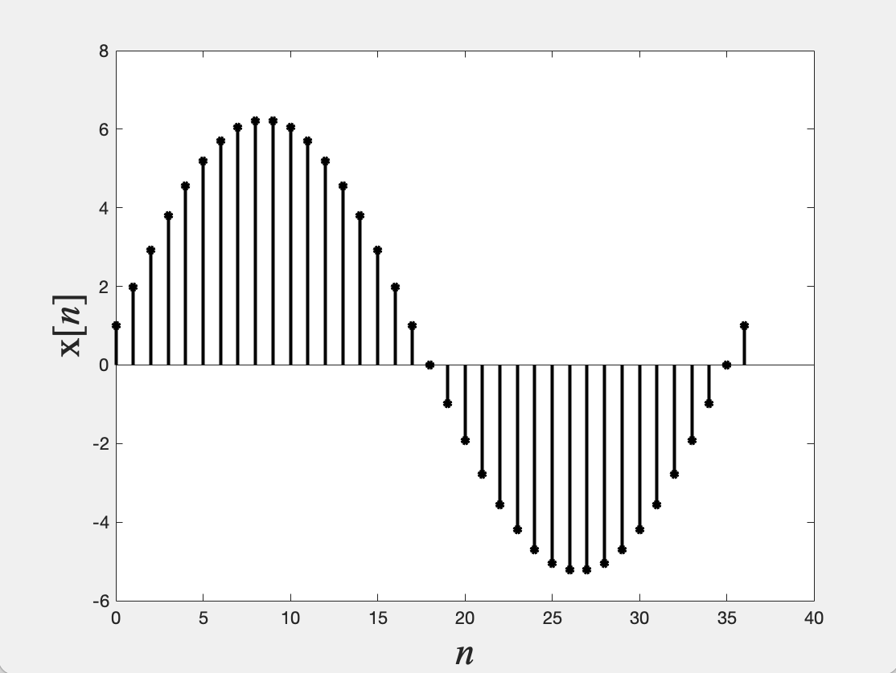

### 문제
Using MATLAB, graph the accumulation of the function x[n] = cos(2pin/36) fron n=0 to n=36 under the asuumption that the accumulation before time n=0 is zero.

### 코드
```matlab
clc; clear all; close all;

n = 0:36 ;
x = cos(2*pi*n/36);

p = stem(n,cumsum(x),'k','filled');
set(p,'LineWidth',2,'MarkerSize',4);
xlabel('\itn','FontName','Times','FontSize',24);
ylabel('x[{\itn}]','FontName','Times','FontSize',24);
```

### 결과
